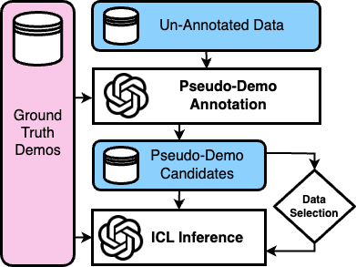

# Semi-Supervised In-Context Learning
In this work, we propose a three-step semi-supervised
ICL framework: annotation generation, demonstration selection, and semi-supervised inference. Our baseline, Naive-SemiICL, which
prompts select high-confidence self-generated
demonstrations for ICL prompting, outperforms a 16-shot baseline by an average of
9.94% across 16 datasets. We further introduce IterPSD, an annotation approach that refines pseudo-demonstrations iteratively, achieving up to 6.8% additional gains in classification tasks.

<div align="center">
  
</div>

## Setup
### Requirements
```
datasets                  3.2.0
matplotlib                3.10.0
openai                    1.58.1
pandas                    2.2.3
pydantic                  2.10.4
seaborn                   0.13.2
torchmetrics              1.6.1
tqdm                      4.67.1
huggingface_hub           0.27.0
```

### Project Structure
The code assumes the following structure for the project:
```
<jupyter notebooks>
...
|-- in_context_ssl
    |-- classification # contains code for classification tasks
        |-- data # demonstration data
        |-- <...>.py
        |-- ...
    |-- reasoning # contains code for translation & reasoning tasks
        |-- data # demonstration data
        |-- <...>.py
        |-- ...
    |-- template.py # abstract template classes
```